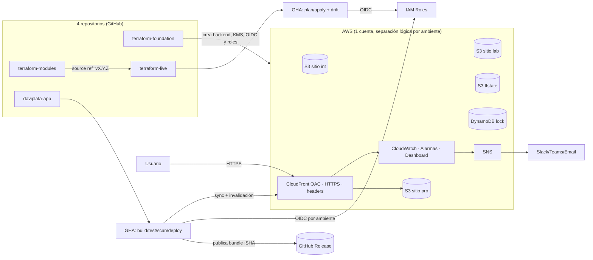
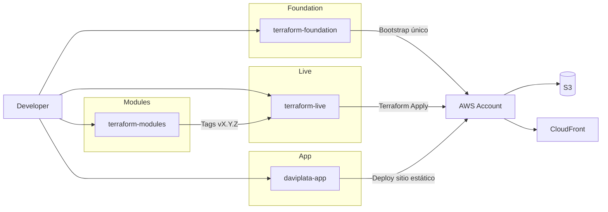

# Arquitectura

## Vista general

**Runtime:** el usuario llega por HTTPS a CloudFront, que aplica cabeceras de seguridad y cachea; el origen es un bucket S3 privado accesible únicamente vía Origin Access Control. CloudFront reporta métricas a CloudWatch, que dispara alarmas hacia SNS.

## Decisiones y por qué

| Área | Decisión | Alternativa considerada | Por qué esta |
|---|---|---|---|
| Cuenta AWS | Una sola cuenta, separación lógica por ambiente | Una cuenta por ambiente | Costo de la prueba; se compensa con roles OIDC exclusivos, backends de estado exclusivos y nombres/tags por ambiente (§8 de la guía interna, ver `docs/cost.md`) |
| Hosting | S3 privado + CloudFront con OAC | S3 Website endpoint | El website endpoint de S3 solo sirve por HTTP y no admite bucket privado; OAC permite bucket 100% privado con HTTPS |
| Empaquetado | Bundle `dist/` inmutable, identificado por commit SHA | Reconstruir por ambiente | Trazabilidad: lo que se probó en integración es exactamente lo que llega a producción |
| IaC | Terraform, módulos y "live" en repos separados | Todo en un repo | La separación por repo obliga a la separación módulo↔resource y a versionar los módulos de forma independiente |
| Backend de estado | Un bucket + una tabla de lock por ambiente, creados una sola vez (`terraform-foundation`) | Backend único compartido | Aislamiento de blast radius: un error de estado en integración no puede tocar producción |
| Publicación de artefactos | GitHub Releases (nativo, repos públicos) | JFrog Artifactory | Con los repos públicos, GitHub Releases da versionado, descarga y registro de artefactos sin costo ni cuenta externa; "promover" un ambiente ya no mueve el archivo (era una copia entre repos de JFrog), solo deja constancia en las notas del release de por dónde pasó — el binario nunca se reconstruye ni se duplica |
| SCA de vulnerabilidades | Trivy | JFrog Xray | Xray es un add-on de pago; Trivy es gratuito y cubre el mismo caso (bundle sin dependencias de runtime) |
| Calidad/SAST/secretos | SonarQube Cloud Free + Gitleaks | Solo Sonar | Free tier de Sonar cubre SAST y detección de secretos, pero Gitleaks da una segunda capa específica de secretos con reglas propias |

## Repositorios y su responsabilidad

- **`terraform-foundation`**: crea lo que no puede depender de sí mismo (backend de estado, OIDC, roles). Cambia con poca frecuencia, pero se gestiona con el mismo GitOps que el resto (plan en PR, apply al merge) — su propio backend remoto lo crea un script idempotente fuera de Terraform, para no depender circularmente de sí mismo.
- **`terraform-modules`**: única fuente de `resource` de la plataforma. Publicado por tag semántico.
- **`terraform-live`**: una sola carpeta `live/`, compone módulos, varía por `.tfvars` y backend parcial. Sin `resource` sueltos.
- **`daviplata-app`**: la aplicación y su pipeline de build/test/scan/deploy/rollback.

## Diagrama de gobierno entre repos

